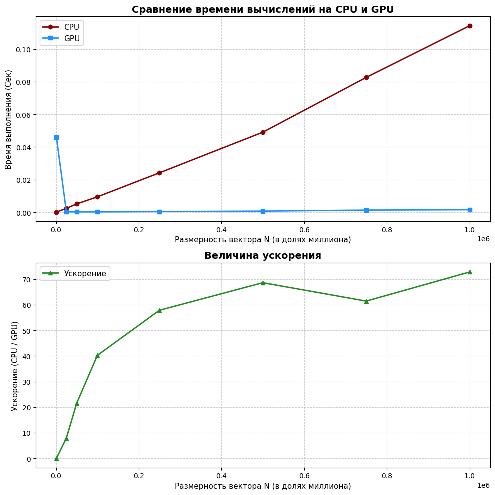

# Лабораторная работа №2 - Нахождение суммы элементов вектора с использованием CUDA

## Описание

В данной работе были реализованы два метода нахождения суммы элементов вектора: последовательное вычисление на CPU и параллельное на GPU с использованием CUDA - ядер, а также проведено сравнение времени выполнения и оценка эффективности распараллеливания вычислений.

## Принцип нахождения суммы элементов на CPU

В функции `compute_sum_CPU` выполняется последовательное вычисление результирующей суммы путем добавления каждого элемента вектора к итоговому значению. В стандартной реализации на CPU применяется однопоточное сложение, что приводит к существенному увеличению времени вычисления с ростом размерности вектора.

## Принцип нахождения суммы элементов на GPU

1. Копирование элементов вектора из CPU в GPU.
2. Конфигурация количества потоков в блоке (16x16 потоков) и количества блоков в сетке.
2. Запуск CUDA - ядра и функции `compiled_reduce_kernel` для вычисления суммы.
3. Копирование результата сложения из GPU в CPU.
4. Освобождение памяти в GPU.

В ходе распараллеливания вычислений на GPU каждый поток вычисляет суммы соответствующих ему элементов вектора. 

Затем промежуточные суммы кэшируются в `shared` памяти. Для свертывания массива промежуточных значений в итоговую сумму применяется механизм **редукции**.

Для обеспечения потокобезопасности при записи суммы в глобальную память используется функция `atomicAdd`.

## Табличное представление результатов

| Размерность вектора | Время CPU (с) | Время GPU (с) | Ускорение |
|-----------------|--------------------|--------------------|--------------------|
| 1 000 | 0.0001 | 0.0460 | 0.00
| 25 000 | 0.0024 | 0.0003 | 7.91
| 50 000 | 0.0051 | 0.0002 | 21.53
| 100 000 | 0.0095 | 0.0002 | 40.22
| 250 000 | 0.0242 | 0.0004 | 57.85
| 500 000 | 0.0491 | 0.0007 | 68.61
| 750 000 | 0.0826 | 0.0013 | 61.43
| 1 000 000 | 0.1143 | 0.0016 | 72.80

## Графическое представление результатов

## Выводы

На относительно небольших размерностях векторов (несколько тысяч элементов) CPU превосходит по скорости решение на GPU в связи с накладными расходами на перемещение вектора в память GPU. Тем не менее, с ростом размерности вектора происходит стабильный рост преимущества CUDA - решения перед традиционным в связи с возможностью вычислять промежуточные суммы параллельно на всех доступных ядрах. Максимум ускорения был достигнут на миллионе элементов и составляет 72.8 раза.

