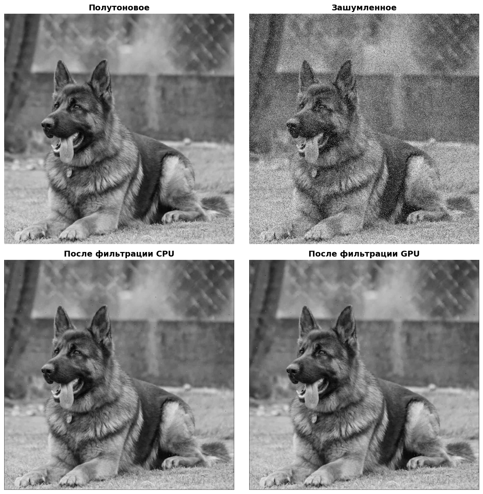

# Лабораторная работа №3 - Медианная фильтрация изображения с использованием CUDA

## Описание

В данной работе были реализованы два метода медианной фильтрации: на CPU и параллельное на GPU с использованием CUDA - ядер, а также проведено сравнение времени выполнения и оценка эффективности распараллеливания вычислений.

## Принцип действия медианной фильтрации

Медианная фильтрация - частный случай `ранговой фильтрации`, где в качестве ранга выступает номер медианного (расположенного по середине) элемента Вариационного ряда. `Вариационный ряд` формируется из пикселей исходного изображения, попавших в скользящее окно размерностью `3 x 3` пикселя. 

Общий вид алгоритма медианной фильтрации выглядит следующим образом:
1. Осуществление отступа в 1 пиксель по краям изображения (во избежание попадания неопределенных значений в скользящее окно).
2. Проход скользящим окном по каждому из оставшихся пикселей исходного изображения. 
3. Создание вариационного ряда (сортировка 9 пикселей из окна по возрастанию яркостей).
4. Выбор медианного пикселя и замена исходного пикселя, находящегося на данной позиции, на медианный.
5. Повторение цикла по всему изображению и создание результирующего.
 
## Принцип фильтрации на CPU

В функции `run_cpu_median` выполняется медианная фильтрация в соответствии с вышеописанным алгоритмом. Для создания вариационного ряда используется встроенная функция `sorted`, имеющая сложность по времени `O(n log n)`. 
В стандартной реализации на CPU, помимо сортировки внутри окна, применяется вложенный цикл `for` для прохода по изображению (сложность `O(n^2)`), что приводит к существенному росту скорости фильтрации на изображениях с большим разрешением.

## Принцип фильтрации на GPU

1. Копирование изображения в виде двумерного массива пикселей из CPU в GPU.
2. Конфигурация количества потоков в блоке (16x16 потоков) и количества блоков в сетке.
2. Запуск CUDA - ядра и функции `gpu_kernel` для медианной фильтрации.
3. Копирование результата из GPU в CPU в виде NumPy - массива.
4. Освобождение памяти в GPU.

Для создания вариационного ряда используется пузырьковая сортировка `(O(n^2))`, но при этом, поскольку результирующее изображение при данном методе фильтрации не зависит от операций над соседними пикселями, **каждый поток осуществляет медианную фильтрацию своего отдельного пикселя**, что приводит к резкому повышению быстродействия с ростом размера изображения.

## Табличное представление результатов

| Время на CPU (с) | 2.05134 
|-----------------|--------------------|
| Время на GPU (с) | 0.00085 
| Значение ускорения | 2399.31 

## Графическое представление результатов

## Выводы

Применение распараллеленных вычислений с использованием библиотеки `CuPy` приводит к существенному росту эффективности фильтрации по сравнению со стандартными методами обработки на CPU. Каждый поток фильтрует отдельный пиксель исходной картинки, следовательно, при росте разрешения изображения, разница в быстродействии вычислений на `CUDA` будет еще более заметной.

