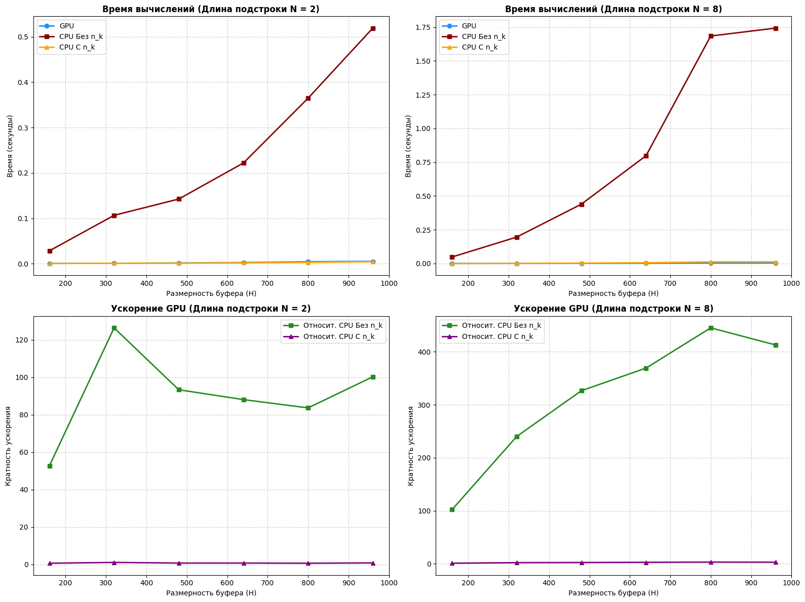

# Лабораторная работа №4 - Массовый поиск подстрок с использованием CUDA

## Описание

В данной работе были реализованы три метода поиска подстрок в исходном буфере: 

1. Последовательный поиск на CPU без предварительного индексирования.
2. Оптимизированный последовательный поиск на CPU с применением словаря символов.
3. Распараллеленный поиск на GPU с использованием CUDA.

Tакже проведено сравнение времени выполнения и оценка эффективности распараллеливания вычислений.

## Принцип действия "наивного" поиска на CPU 

В функции `execute_cpu_naive_search` выполняется массовый поиск подстрок путем прохода по каждому элементу рабочей матрицы `result_matrix` с индексом `(i,j)`. Если символ `k` подстроки `N[i]` совпал с текущим значением буфера `H[j]`, то следует уменьшение значения `result_matrix[i,j-k]`. Поскольку для поиска используется тройной вложенный цикл, вычислительная сложность растет как куб `(N x M)`, где `N` - количество и длина подстрок, `M` - размерность буфера.

## Оптимизация "наивного" поиска: создание словаря вхождений символов

В функции `build_character_index` осуществляется предварительная обработка алфавита - создание словаря вхождений символов, где ключ - эдемент алфавита, значение - пара `(n,k)`, при этом `n` - индекс подстроки `N`, `k` - индекс символа в данной подстроке.

## Принцип действия "оптимизированного" поиска на CPU
 
В функции `execute_cpu_indexed_search` осуществляется итерация по каждому символу буфера `H`, в результате чего получается пара `(n,k)` вхождения рассматриваемого символа в подстроки. Затем, для каждой пары также следует уменьшение значения `result_matrix[i,j-k]`. 
В данной реализации удается избежать кубического роста вычислительной сложности, однако все равно тратится время на прохождение по буферу, а также создание и работу со словарем вхождений.

## Принцип действия распараллеленного поиска на GPU с использованием CUDA

В данной реализации искомая проблема массового поиска подстрок (N x M) отображается на двумерную сетку потоков. **Каждый поток отвечает за сравнение только одного шаблона подстроки с одним символом исходного буфера**. Внутри подстроки осуществляется итерация по ее элементам с помощью цикла `for`. 
При запуске функции `execute_gpu_search` создаются блоки размером 16 x 16 потоков. Ось `X` решетки отвечает за символы в буфере, ось `Y` - за шаблоны подстрок. Внутри `CUDA - ядра` каждый поток высчитывает свою абсолютную глобальную позицию, а во избежание ситуации, когда несколько потоков пытаются одновременно уменьшить значение `result_matrix` используется атомарная операция сложения `AtomicSub`.

## Табличное представление результатов

<table border="1" class="dataframe">
  <thead>
    <tr style="text-align: right;">
      <th></th>
      <th>Substring_Length</th>
      <th>Buffer_Size</th>
      <th>GPU_Time</th>
      <th>CPU_Naive_Time</th>
      <th>CPU_Indexed_Time</th>
      <th>Correctness</th>
      <th>Accel_Naive</th>
      <th>Accel_Indexed</th>
    </tr>
  </thead>
  <tbody>
    <tr>
      <th>0</th>
      <td>2</td>
      <td>160</td>
      <td>0.000538</td>
      <td>0.028349</td>
      <td>0.000362</td>
      <td>PASS</td>
      <td>52.722140</td>
      <td>0.673515</td>
    </tr>
    <tr>
      <th>1</th>
      <td>2</td>
      <td>320</td>
      <td>0.000843</td>
      <td>0.106538</td>
      <td>0.000924</td>
      <td>PASS</td>
      <td>126.384180</td>
      <td>1.096163</td>
    </tr>
    <tr>
      <th>2</th>
      <td>2</td>
      <td>480</td>
      <td>0.001527</td>
      <td>0.142472</td>
      <td>0.001152</td>
      <td>PASS</td>
      <td>93.326878</td>
      <td>0.754646</td>
    </tr>
    <tr>
      <th>3</th>
      <td>2</td>
      <td>640</td>
      <td>0.002520</td>
      <td>0.221935</td>
      <td>0.001912</td>
      <td>PASS</td>
      <td>88.058336</td>
      <td>0.758742</td>
    </tr>
    <tr>
      <th>4</th>
      <td>2</td>
      <td>800</td>
      <td>0.004362</td>
      <td>0.364838</td>
      <td>0.002897</td>
      <td>PASS</td>
      <td>83.642653</td>
      <td>0.664243</td>
    </tr>
    <tr>
      <th>5</th>
      <td>2</td>
      <td>960</td>
      <td>0.005179</td>
      <td>0.519214</td>
      <td>0.004310</td>
      <td>PASS</td>
      <td>100.248872</td>
      <td>0.832254</td>
    </tr>
    <tr>
      <th>6</th>
      <td>8</td>
      <td>160</td>
      <td>0.000474</td>
      <td>0.048399</td>
      <td>0.000507</td>
      <td>PASS</td>
      <td>102.163899</td>
      <td>1.069955</td>
    </tr>
    <tr>
      <th>7</th>
      <td>8</td>
      <td>320</td>
      <td>0.000816</td>
      <td>0.196012</td>
      <td>0.001798</td>
      <td>PASS</td>
      <td>240.132801</td>
      <td>2.202804</td>
    </tr>
    <tr>
      <th>8</th>
      <td>8</td>
      <td>480</td>
      <td>0.001346</td>
      <td>0.439445</td>
      <td>0.003281</td>
      <td>PASS</td>
      <td>326.435799</td>
      <td>2.436980</td>
    </tr>
    <tr>
      <th>9</th>
      <td>8</td>
      <td>640</td>
      <td>0.002162</td>
      <td>0.798022</td>
      <td>0.006146</td>
      <td>PASS</td>
      <td>369.143592</td>
      <td>2.842769</td>
    </tr>
    <tr>
      <th>10</th>
      <td>8</td>
      <td>800</td>
      <td>0.003784</td>
      <td>1.683886</td>
      <td>0.012278</td>
      <td>PASS</td>
      <td>445.008611</td>
      <td>3.244891</td>
    </tr>
    <tr>
      <th>11</th>
      <td>8</td>
      <td>960</td>
      <td>0.004220</td>
      <td>1.742238</td>
      <td>0.012787</td>
      <td>PASS</td>
      <td>412.875002</td>
      <td>3.030303</td>
    </tr>
  </tbody>
</table>

## Графическое представление результатов

## Выводы

Неоптимизированная реализация массового поиска подстрок значительно уступает распараллеленной реализации на `CuPy`. Использование словаря вхождений существенно повышает эффективность поиска на `CPU`, тем не менее, `CUDA - реализация` все еще остается более эффективной за счет использования большого числа потоков, каждый из которых проверяет только один шаблон и один символ буфера. Следовательно, при увеличении количества подстрок и/или размера буфера, параллельная реализация будет еще быстрее `CPU - метода`. 

